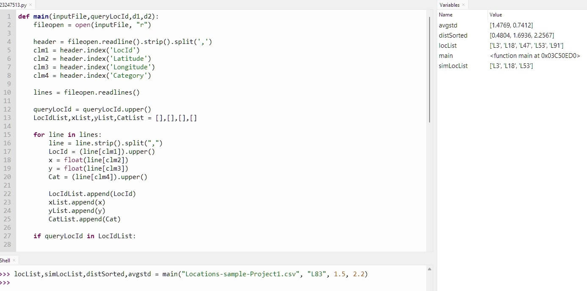
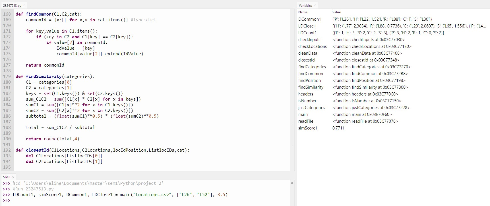

# Projects

Projects developed for units during the Master's course in Information Technology at the University of Western Australia.

This repository serves as a brief reflection of my academic journey at the University of Western Australia, culminating in the completion of my Master's in Information Technology in July 2023.

## Key Coursework

The core subjects I engaged with encompassed:

1. **Computational Thinking with Python (CITS1401)**: This course provided a solid foundation in Python programming and computational thinking concepts.

2. **Open Source Tools and Scripting (CITS4407)**: In this course, I learned about open-source tools and scripting, further enhancing my programming skills.

3. **Software Engineering with Java (CITS1001 )**: This course covered software engineering principles using Java as the primary programming language.

4. **Cloud Computing (CITS5503)**: I explored the world of cloud computing in this course, gaining knowledge about AWS cloud technologies and services.

5. **Relational Database Management Systems (CITS1402)**: This unit deals with data modelling through the theory and practice of database design, implementation and use.

## Projects

As part of my coursework, I completed several projects that allowed me to apply the knowledge gained in practical scenarios. Here are brief descriptions of a few of them:

### Project 1: [Analyze Location Program](Project-1/)

In this project, I developed a Python program to analyze location data from a CSV file. The program takes input parameters, including a query location ID and rectangular dimensions, and returns relevant information. It identifies locations within the specified region, locations with the same category as the query location, and calculates distances to these locations. Additionally, it provides statistical results like the average and standard deviation of distances. The program is designed to handle various scenarios, including different data files and missing data. It's a practical demonstration of my Python programming skills and problem-solving abilities, emphasizing efficiency and code clarity. This project showcases my ability to work with real-world data and extract meaningful insights.

[See more](Project-1/)

### Project 2: [Python Location Data Analysis](Project-2/)

In this project, I developed a Python program to analyze location data from CSV files, demonstrating my proficiency in data manipulation, geospatial analysis, and algorithm development in Python. The program processes latitude, longitude, and category information to deliver valuable insights. It performs several tasks, including data cleaning (ensuring data integrity by filtering out invalid or duplicate entries), geospatial analysis (calculating distances between locations and identifying locations within a specified radius of interest), category analysis (categorizing locations and providing statistics on their distribution), similarity calculation (computing cosine similarity between two specified regions), and finding the closest location of each category to two specified points. This project showcases my ability to extract meaningful insights from complex datasets and solve real-world problems efficiently.

[See more](Project-2/)

Feel free to explore this repository to learn more about my academic journey and the projects I've worked on. If you have any questions or would like to connect, please don't hesitate to reach out.

Thank you for visiting!
