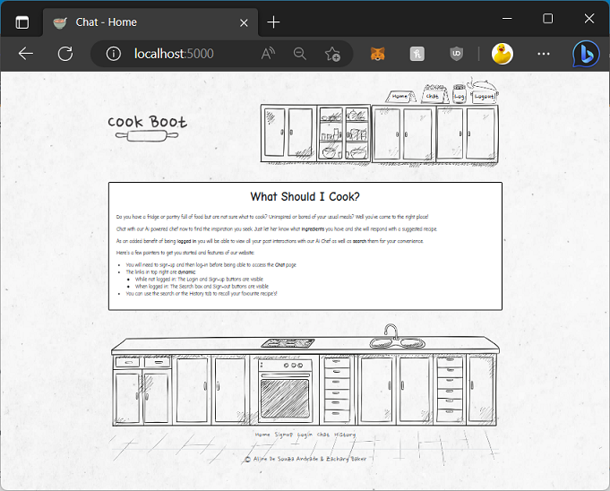

# CITS5505 Assignment 2 - Web Project

## Group Members:

Aline De Souza Andrade (23247513)  
Zachary Baker (23155062)

## Get Cooking!:

Cookboot is an easy-to-use web application designed to help users effortlessly find delicious recipes. By informing the ingredients available in the fridge and pantry, our app will suggest a recipe that makes the most of what you already have.

To start using the app, users must create an account via the **Signup** page and login to the **Login** page. Once logged in, they can enter the available ingredients on the **Chat** page, where our app will generate the recipe that can be prepared with these provided ingredients.

Furthermore, CookBoot offers additional functionality to increase user convenience. The **Log** page allows the user to easily access and review the recipes searched, being able to portal them by email. There is also a search option on the **Chat** page which allows the user to filter recipes based on a specific word.

Whether you're an experienced chef looking for culinary inspiration or a beginner eager to explore new dishes, Cookboot is here to support your culinary experience. Start exploring the world of flavors and embark on a culinary journey with Cookboot today!



## Architecture

### Frontend:

- base.html: base template that defines the structure of the application, including the header and footer.
- index.html: home page of the application, containing an introduction to the app.
- signup.html: page where new users can create an account.
- login.html: page where users can authenticate themselves.
- chat.html: page where users input the ingredients and receive a recipe suggestion and allows to filter.
- history.html: page that displays the user's chat history and allows them to send it via email.
- references.html: A page that provides references for the project.

### Model-View-Controller (MVC):

Our application is designed using the model-view-controller design pattern. Our main \*.py files are:

- controller.py
- forms.py
- models.py
- routes.py

#### models.py

Our application uses SQLAlchemy to establish two database tables, below you can see a snippet from the file to demonstrate the schema. Our **model** represents the data and desired application logic.

Of note is a foreign key constraint between Message and User to enforce a relationship between recorded messages and the logged-in user who generated them. Email and Timestamp are unused fields at this time, but used so commonly that they could have come in handy depending on our project goals.

```python
...

class User(UserMixin, db.Model): # UserMixin provides methods required by Flask-Login
    id = db.Column(db.Integer, primary_key=True)
    username = db.Column(db.String(64), index=True, unique=True)
    email = db.Column(db.String(120), index=True, unique=True)
    password_hash = db.Column(db.String(128))
    Messages = db.relationship('Message', backref='author', lazy='dynamic')

class Message(db.Model):
    id = db.Column(db.Integer, primary_key=True)
    content = db.Column(db.String(140))
    response = db.Column(db.String(140))
    timestamp = db.Column(db.DateTime, index=True, default=datetime.utcnow)
    user_id = db.Column(db.Integer, db.ForeignKey('user.id'))

...
```

#### routes.py

Our routes.py file primarily houses the code responsible for rending the HTML templates & returning the correct resopnses to the client. In combination with our HTML & CSS files they constitute the **views** of the MVC design pattern. Here is a snippet from our routes functions. While we have tried to move all control functions to the controller.py file, you will notice the first route retains its method, there is some flexibility in the design pattern.

```python
@app.route('/')
@app.route('/index/')
def index():
    id = "index"
    return render_template('index.html', title_page="Home", class_page=id)

@app.route('/login/', methods=['GET', 'POST'])
def login():
    return controller.login()

@app.route('/logout/')
def logout():
    return controller.logout()

...
```

#### controller.py

The code in this file handles the user input, interacts with our models, performs application logic operations and returns the data required by the views. These represent the **controller** elements of the MVC design pattern. We have tried to move all our control logic here as is practical:

```python
...

def logout():
    logout_user()
    return redirect(url_for('index'))

def history():
    id = "history"
    messages = current_user.Messages.all()
    summaries = []
    for message in messages:
        summary = get_summary(message.response)
        summaries.append(summary)
    return render_template('history.html', title_page="History", class_page=id, messages=messages, summaries=summaries)

...
```

## Launch FLASK web application:

On Windows, install Python 3.11.3 via the Microsoft Store. Type **Python** at a Powershell prompt for a shortcut to the store. Python, Pip & Idle will be set correctly in PATH.

To allow the execution of scripts in Windows, in an elevated Powershell window (warning: makes security changes to the local computer):

```powershell
Set-ExecutionPolicy RemoteSigned
```

At the regular Powershell prompt in vsCode:

```powershell
python3 -m venv env
.\env\Scripts\activate
pip install flask
```

Update the packages that are used in the project (if necessary):

```bash
pip install -r requirements.txt
```

Initialise the database

```bash
flask db init
flask db migrate
flask db upgrade
```

Run the application

```bash
flask run
```

Check: http://localhost:5000

## Testing:

Our test schema is composte for:

- tests (main folder for tests)
  - functional (folder for functional tests)
    - test_login.py (Python file containing tests related to login functionality)
  - unit (folder for unit tests)
    - test_app.py (Python file containing unit tests for your application)
  - conftest.py (Python file containing test fixtures and configuration)

### Using pytest:

Install pytest in your virtual enviroment

```bash
pip install pytest
```

Start Flask (instructions above) and create this user via the website:

```
Username: testValid
Email: not@important.com
Password: 123456A
```

Log in to the website with this user, then run the tests in the virtual environment via this command:

```bash
pytest
```

To test a specific file <code>pytest PATH</code>, example:

```bash
 pytest app\tests\unit\test_app.py
```

### test_app.py:

This provides tests to verify the pages existence and functionality.

#### Example:

- **test_index_page:** This test checks if the root page ("/") returns a response with a status code of 200 (indicating a successful request) and if the response data contains the string "What Should I Cook".

### test_login.py:

This provides tests for the user registration and login functionality.

#### Example:

- **test_user_already_exists_usernme:** This test checks if the registration form validates correctly when trying to create a user with both a duplicate username and a different email. It creates a user with a specific username in the database, submits the registration form with the same username but a different email, and asserts that the form validation fails.

## Other Related Notes:

Dump the installed Python packages for future deployments. Thes can be installed later via <code>pip install -r requirements.txt</code>

```
pip freeze >> requirements.txt
```

Setting System Variables (if not using the default):

```
setx FLASK_APP "my_app.py"
```
